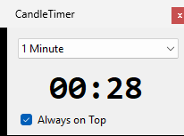

# CandleTimer

A lightweight, always-on-top C# WinForms desktop timer overlay designed for traders using platforms like thinkorswim. It counts down to candle closes across standard timeframes in real time.

## Features

- **Standard Timeframe Intervals:** Select between 1m, 2m, 3m, 5m, and 15m candle close tracking.
- **Always-on-Top Floating Overlay:** Keeps the timer visible above trading software and chart windows.
- **Audible Close Alerts:** Plays a subtle audio chime precisely as a candle period resets.
- **Zero Configuration:** Automatically aligns with system clock and network NTP time without external dependencies.

## Built With

- C# / .NET WinForms