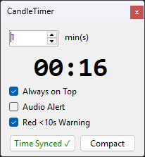

# CandleTimer

**CandleTimer** is a lightweight, precision-timed desktop utility built for traders who need accurate candle close countdowns. It synchronizes with NTP (Network Time Protocol) servers to bypass local computer clock drift and ensure exact timing down to the millisecond.



---

## Key Features

* **Precision NTP Synchronization:** Fetches atomic time via `pool.ntp.org` to keep countdowns perfectly aligned with trading platforms.
* **Custom Timeframe Selection:** Supports any custom minute interval (1–1440 mins). Use the spinner arrows or type any number directly into the input box.
* **Predictable Timeframe Switching:** Adjusting timeframes dynamically recalculates the remaining time relative to the current minute offset without random jumps.
* **Compact View Mode:** Shrinks the overlay to a minimal footprint with a clean indicator showing the active timeframe (e.g., `[ 5 mins ]`) to maximize chart space.
* **Visual Warning:** Text automatically turns red when less than 10 seconds remain on the current candle.
* **Optional Audio Chime:** Toggleable audio alert that plays a subtle sound when a new candle opens (disabled by default).
* **Always-on-Top:** Floating overlay window remains pinned above trading charts and browser windows.

---

## How to Run

### Requirements
* Windows 10 / 11
* .NET Desktop Runtime (or Visual Studio 2022 / 2026)

### Building from Source
1. Clone the repository:
   ```bash
   git clone [https://github.com/ConceptExplorer/CandleTimer.git](https://github.com/ConceptExplorer/CandleTimer.git)